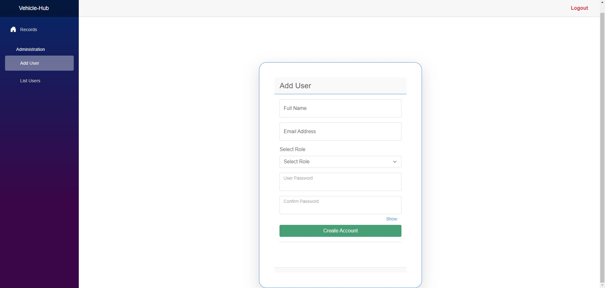

# .NET-Blazor-App-Test

## Description
This is a fullstack application test that displays information about a system of vehicle ownership
and comes with an admin interface for managing users. The auth can be done via an external provider 
as well. The main purpose was to introduce clean architecture and learn more about Blazor technology.

## The stack:
- ASP.NET Core Web API for backend side
- Blazor WebAssembly for frontend side
- nginx for hosting the Blazor frontend app
- PostgreSQL database for data persistence
- Duende Identity Server for external auth provider
- Seq for logging management
- Docker for deployment

## Installation
1. Above the list of files, click <>Code.
2. Copy the desired URL for the repository (HTTPS, SSH), or use Github CLI.
3. Open Git Bash on your machine.
4. Change the current working directory to the location where you want the cloned directory:
    ```bash
        cd <workdir_name>
    ```
5. Type git clone, and then paste the URL you copied earlier:
    ```bash
        git clone <copied_URL>
    ```
6. Make a file in the directory, called .env and fill it according to the .env.template file:
    ```bash
        touch .env
    ```
   If you decide to change the recommended ports for the docker configuration, then you will have to change them in the projects config files as well.
7. If you have Docker installed, make sure you are in the project directory, open a terminal and type:
   ```bash
      docker-compose up --d
   ```
8. Using the recommended port settings, you can access the swagger pages like so:
    - Frontend -> https://localhost:7443
    - Backend-API -> https://localhost:6443/swagger
    - Identity-API -> https://localhost:9443

## Required Information
By default, the deployed services are set up to run on their specific localhosts:
- backend will run on port 5001;
- frontend will run on port 5173;
- database will run on port 5432;

If you wish to change these settings:
1. Frontend (all have to be the same):
    - navigate to vite.config.ts file in the *project_folder/Client* folder and change the port to your desired one;
    - navigate to the Dockerfile in the *project_folder/Client* folder and change the EXPOSE port and change the port to your desired one;
    - navigate to docker-compose.yml file in the project folder and change the port in the frontend service change the port to your desired one;
2. Backend (all have to be the same):
    - navigate to appsettings.json file in *project_folder/API/API* and change the URL in the Kestrel key to your desired one;
    -  navigate to the Dockerfile in the *project_folder/API* folder and change the EXPOSE port and change the port to your desired one;
    - navigate to docker-compose.yml file in the project folder and change the port in the backend service and change the port to your desired one;
3. Database:
    - navigate to docker-compose.yml file in the project folder and change the port in the database service and change the port to your desired one;
    - navigate to docker-compose.yml file in the project folder and change the port in the backend service -> environment -> connection_string and change the port to your desired one;

Additionally, you will have update the connection string for database with your postgreSQL credentials:
- USERNAME
- PASSWORD

## Visuals

### Backend-API


### PG Admin Viewer


### Frontend Login


### Login Validation


### Frontend Vehicle Dashboard


### Frontend Admin Users Dashboard


### Admin Add Users View


### Identity-API External Login


## Final Note
This project definetly need improvements and lacks high client complexity. On my list of such improvements,
I can put: refactoring the Blazor pages in smaller components, on the backend introducing the already 
started generic repository with specification pattern instead of using the EF context, better swagger 
documentation and more efficiency on nginx routing.

## License
This project is licensed under the MIT License. See the LICENSE file for details.

## Contact
Feel free to contact me at: karjhan1999@gmail.com